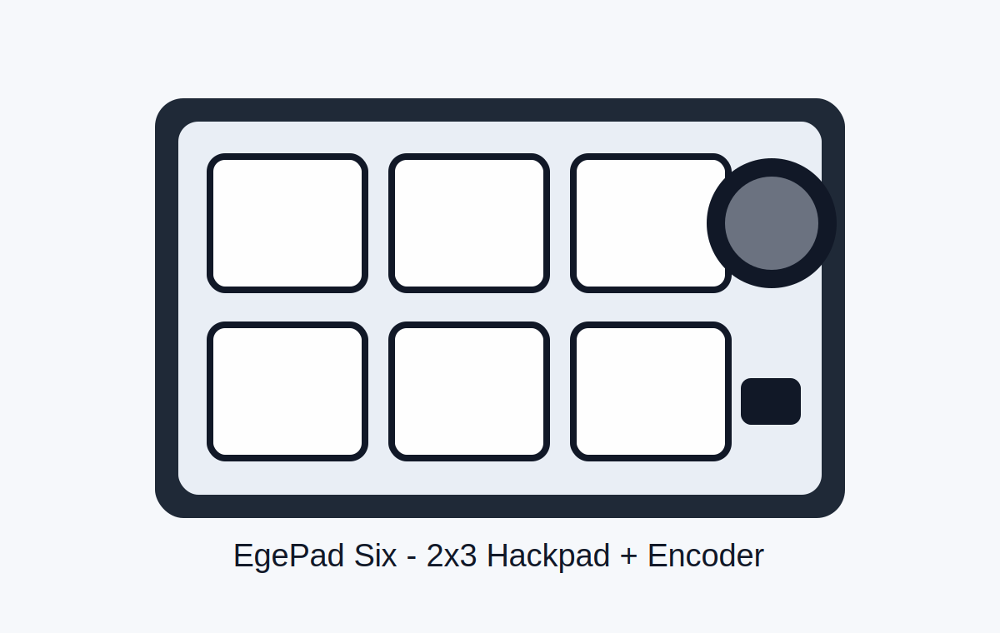
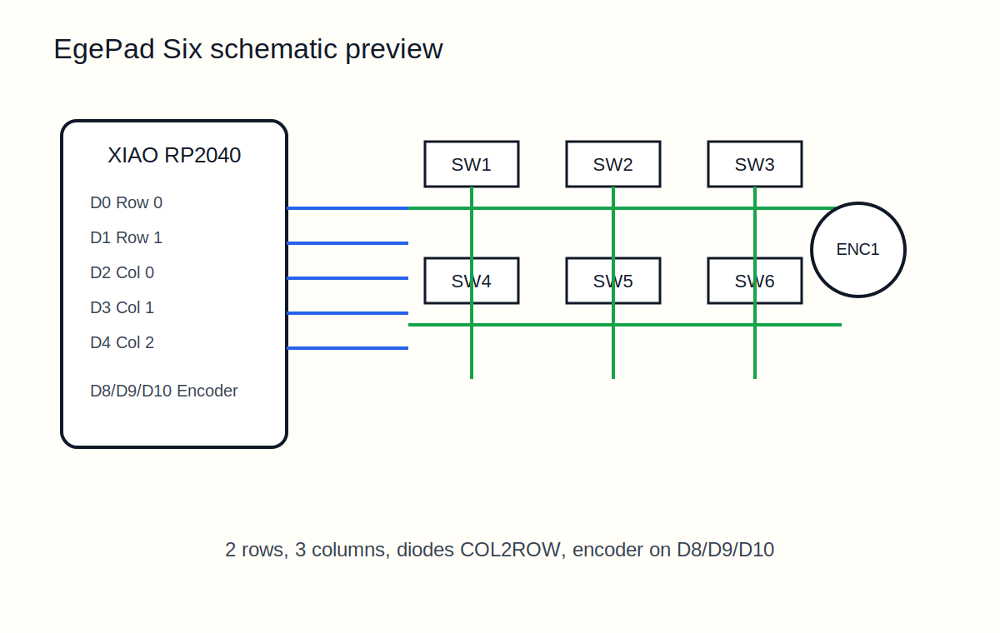
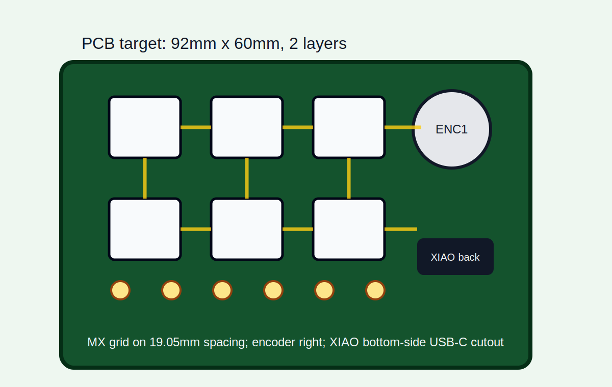
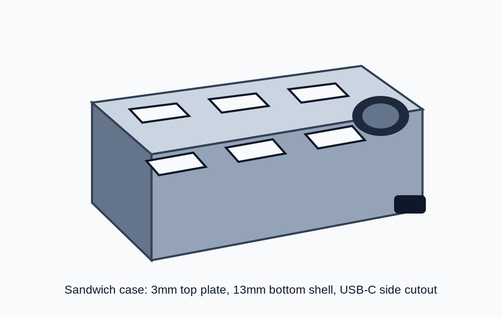

# EgePad Six Hackpad

Project owner: **Ege Özdemir**

EgePad Six is a compact Hackpad macropad design for the Hack Club Hackpad mission. It uses a 2x3 MX switch matrix, one EC11 rotary encoder, and a Seeed XIAO RP2040 running KMK firmware.

GitHub repository: https://github.com/Mert-Oezdemir/egepad-six-hackpad

This repository follows the Hackpad submission structure described in the official guide: PCB design files, CAD/STEP case files, firmware, and production outputs are kept in separate folders.

Stardance helper: open [START_STARDANCE.html](START_STARDANCE.html) locally for project links and one-click copy fields.

Official reference:
- Hackpad guide: https://hackpad.hackclub.com/guide
- Stardance Hackpad mission guide: https://stardance.hackclub.com/missions/hackpad/guide

## Design Summary

| Item | Value |
| --- | --- |
| Name | EgePad Six |
| Owner | Ege Özdemir |
| MCU | Seeed XIAO RP2040 |
| Inputs | 6 MX switches + 1 EC11 rotary encoder |
| Firmware | KMK / CircuitPython |
| PCB size target | 92mm x 60mm, 2-layer |
| Case size target | 112mm x 80mm x 18mm |
| Switch spacing | 19.05mm center-to-center |
| Mounting | M3 screws + M3 heatset inserts |

## Render / Screenshots

### Macropad Design Render



### Schematic Preview



### PCB Layout Preview



### Case 3D Preview



## Bill Of Materials

| Ref | Component | Qty | Source |
| --- | --- | ---: | --- |
| U1 | Seeed XIAO RP2040 | 1 | Hackpad kit |
| SW1-SW6 | MX-style mechanical switch | 6 | Hackpad kit |
| D1-D6 | 1N4148 through-hole diode | 6 | Hackpad kit |
| ENC1 | EC11 rotary encoder, 20mm D-shaft | 1 | Hackpad kit |
| KC1-KC6 | Blank DSA keycap | 6 | Hackpad kit |
| H1-H6 | M3 x 5 x 4mm heatset insert | 6 | Hackpad kit |
| S1-S6 | M3 x 16mm screw | 6 | Hackpad kit |
| PCB | 2-layer PCB, max 92mm x 60mm | 1 | JLCPCB grant |
| CASE | 3D-printed top and bottom case | 1 set | Printing Legion |

CSV version: [BOM.csv](BOM.csv)

## Wiring Plan

The key matrix uses two rows and three columns:

| Matrix | Column 0 | Column 1 | Column 2 |
| --- | --- | --- | --- |
| Row 0 | SW1 | SW2 | SW3 |
| Row 1 | SW4 | SW5 | SW6 |

XIAO pin plan:

| Function | XIAO Pin |
| --- | --- |
| Row 0 | D0 |
| Row 1 | D1 |
| Col 0 | D2 |
| Col 1 | D3 |
| Col 2 | D4 |
| Encoder A | D8 |
| Encoder B | D9 |
| Encoder button | D10 |

Diode orientation target: `COL2ROW`, with diode stripe toward the row wire.

## Folder Structure

```text
.
├── README.md
├── CAD/
│   ├── assembled-model.STEP
│   ├── Top.STEP
│   ├── Bottom.STEP
│   └── README.md
├── PCB/
│   ├── egepad.kicad_pro
│   ├── egepad.kicad_sch
│   ├── egepad.kicad_pcb
│   └── README.md
├── Firmware/
│   └── main.py
└── production/
    ├── gerbers.zip
    ├── Top.STEP
    ├── Bottom.STEP
    └── main.py
```

## Pre-Submission Status

See [RELEASE_STATUS.md](RELEASE_STATUS.md).

Requirement mapping:

- [Hackpad requirements map](HACKPAD_REQUIREMENTS_MAP.md)
- [Stardance submission handoff](STARDANCE_SUBMISSION.md)
- [Stardance launch helper](START_STARDANCE.html)
- [Mechanical dimensions](CAD/MECHANICAL_DIMENSIONS.md)
- [Firmware notes](Firmware/README.md)

Important note: this environment does not have KiCad CLI or a CAD kernel installed, so the PCB DRC, real Gerber export, and STEP geometry have not been tool-verified here. The repo is prepared as a complete Hackpad submission package scaffold and should be opened in KiCad/Fusion 360 for final manufacturability checks before submitting.
